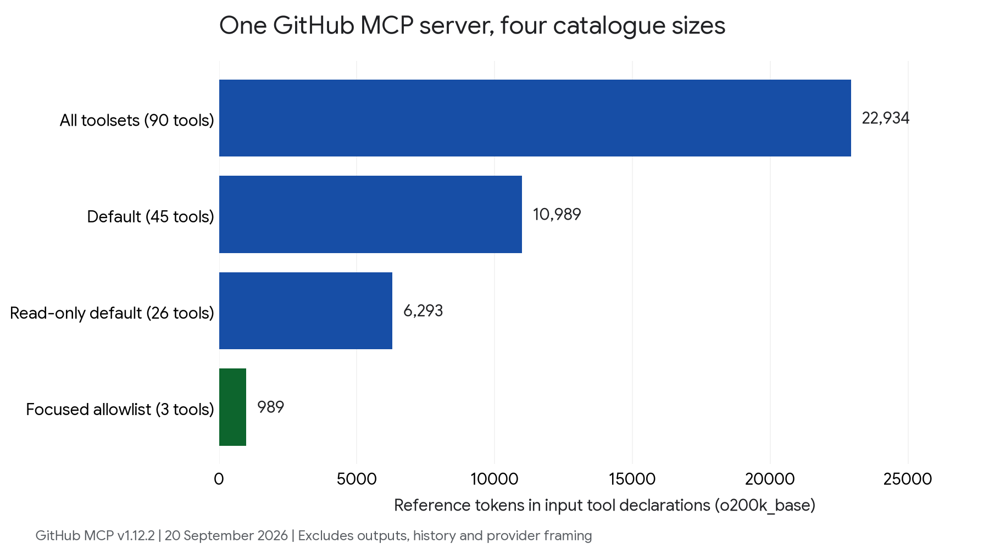

# MCP context benchmark

Reproducible measurements of how MCP tool catalogues reach agent context, using GitHub MCP server **v1.12.2** as a common input.

The default 45-tool input catalogue counts **10,989 reference tokens**; a three-tool allowlist counts **989**. Framework and CLI captures show how filtering and discovery change initial exposure. These are `o200k_base` reference counts, except for the separately labeled native Antigravity usage. They are not interchangeable with provider billing or complete-task cost.



## Reproduce the retained measurements

Requires [uv](https://docs.astral.sh/uv/). From the repository root:

```bash
uv run --script analyze.py
```

This validates the retained controls and regenerates `results.json`, `catalogue.csv`, `checksums.json`, and the figure. No model credentials or inference are needed. The first invocation downloads pinned dependencies and the tokenizer encoding.

- [Results and measurement scopes](results.json)
- [Capture methods, versions, and rerun instructions](METHODS.md)
- [Sanitized provider and MCP observations](data/)
- [Release artifact URLs and verified checksums](data/environment.json)

Tested locally: LangChain/LangGraph, Google ADK, CrewAI, PydanticAI, Claude Code, Codex CLI, goose, and Antigravity CLI. Cursor and VS Code were not locally measured and are excluded from the numerical comparison.

## Complete GitHub task experiment

The reference harness in [task/](task/) compares eager exposure against deterministic tool discovery using **Gemini 3.8 Flash, low thinking**. It performs real read-only GitHub MCP calls, checks a pinned source file, and grades the answer independently of the model. Five paired trials, bounds, source projection, and grading rules are declared in [the plan](task/PLAN.md).

**Status: all ten planned attempts retained; verdict inconclusive.** Each strategy passed 2/5 attempts. Five attempts hit provider errors or a client timeout; one discovery answer had correct facts but violated the JSON-only format. The only pair where both passed used 33,807 input tokens eagerly versus 14,067 with discovery, a 58.4% reduction including search turns. See [every attempt, usage, latency, and limits](task/results/). No failures were replaced. This harness is a strategy comparison, not an end-to-end measurement of the named coding clients.

Recompute the task summary without inference:

```bash
python task/analyze_task.py task/results
```

To validate its logic without inference:

```bash
uv run --no-project --python 3.13.5 --with google-genai==2.24.0 --with mcp==2.2.0 \
  --with jsonschema==4.26.0 python -m unittest discover -s task -p 'test_*.py'
```

To run the paid experiment, download and verify the GitHub server specified in `data/environment.json`. Authenticate to your chosen GCP project with Application Default Credentials (ADC), and supply either `GITHUB_PERSONAL_ACCESS_TOKEN` through your secret manager or an authenticated `gh` installation. The provider is explicitly GCP; ambient API keys do not select another backend. Use a fresh output directory outside this repository:

```bash
mkdir /absolute/path/to/new-results
cp task/fixture.json /absolute/path/to/new-results/fixture.json
uv run --python 3.13.5 --script task/task_benchmark.py \
  --project YOUR_GCP_PROJECT --location global \
  --server /absolute/path/to/github-mcp-server \
  --output /absolute/path/to/new-results
python task/analyze_task.py /absolute/path/to/new-results
```

Seed the fresh directory with the retained fixture as shown: the runner rejects a changed observation when that file is present. Without it, the runner establishes a new fixture, which must not be silently pooled with these results.

This command uses account quota and performs model inference. The execution boundary rejects writes, other repositories, other issues, and unpinned source reads. Model retries are disabled; planned failures are retained. The task's stable model alias and live issue can change, so compare observed model versions and fixture digests before combining runs.

## Scope and attribution

Startup evidence was collected on September 20, 2026; the separate complete-task experiment ran on September 21. Startup captures do not measure tool-search accuracy or full-task efficiency. In particular, a native provider can receive deferred schemas in its HTTP request while excluding them from the model's initial context. See [METHODS.md](METHODS.md) before ranking numbers across hosts.

Original benchmark code is MIT-licensed. Upstream schemas, source fixtures, and fonts retain their own notices in [THIRD_PARTY.md](THIRD_PARTY.md). Credentials, private prompts, conversation IDs, and third-party executables are not included. Raw new captures should be inspected and normalized before sharing.
